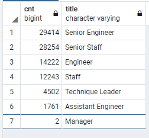
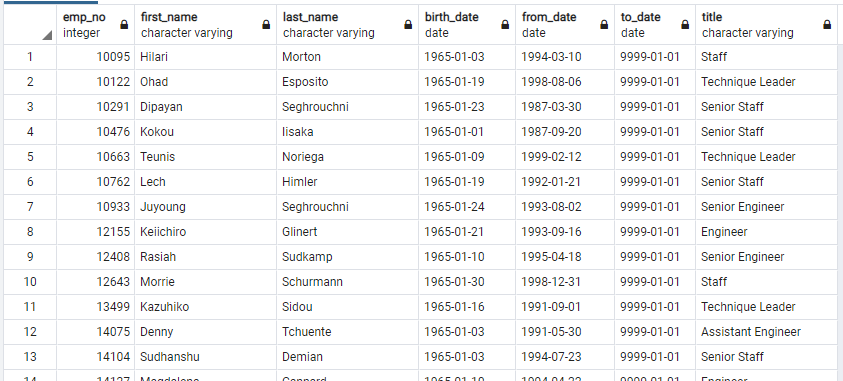
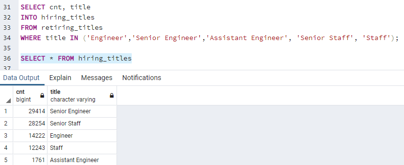
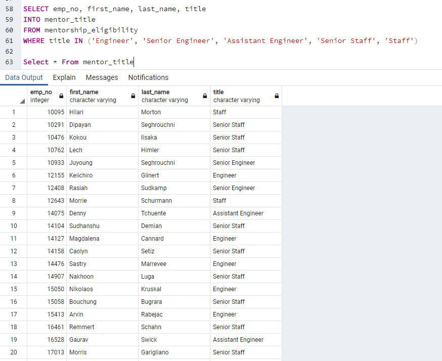

# Pewlett Hackard Analysis

## Overview
The purpose of this analysis involves using SQL to provide detail and information to Bobby's manager about the following information:
- Number of retiring employees per title
- Employees who are eligible to participate in a mentorship program

## Results
### Deliverable 1: To determine the number of retiring employees based on their titles

SQL queries were used to create the Retirement Tables table that holds all the titles of current employees who were born between January 1, 1952 and December 31, 1955. Below is the summary table:

- There are 90,398 employees that will be retiring soon.
- Only two managers will be retiring soon from the company.
- The top three positions that will retiring soon from the company are:
  - Senior Engineer
  - Senior Staff
  - Engineer
- Based on the top three positions that will be retiring soon from the company, there is a need for more hiring of mid-level to experienced level engineers.

### Deliverable 2: To determine the employees that are eligible to particpate in a mentorship program.

SQL queries were used to create a mentorship-eligibility table that holds the current employees who are born between January 1, 1952 and December 31, 1955. Below is the summary table:

- A total of 1549 employees who are eligible to particpate in a mentorship program. 
- A total of 225 Senior Engineers are eligible for the mentorship program.
- A total of 504 Senior Staff are eligible for the mentorship program.
- A total of 451 Engineers are eligible for the mentorship program

## Summary
Based on the analysis above, two conclusions are summarized below:
- There will be a need to hire alot of Engineers (Senior Engineer, Engineer, and Assistant Engineer) and Staff members (Senior Staff and Staff) since there are 85,894 employees expected to retire. Using SQL, the below query and summary table were used to determine the number of applicants needed based on their titles.

- There are only 1549 who are eligible to partcipate in the mentorship program. However, there are a need to hire 90,398 employees. This means that to mentor new employees joining the company, each mentor will have about 58 mentees. This number is too high for a mentor to maintain. Using SQL, the below query and summary table were used to determine the number of mentors that are Engineers and Staff members.

